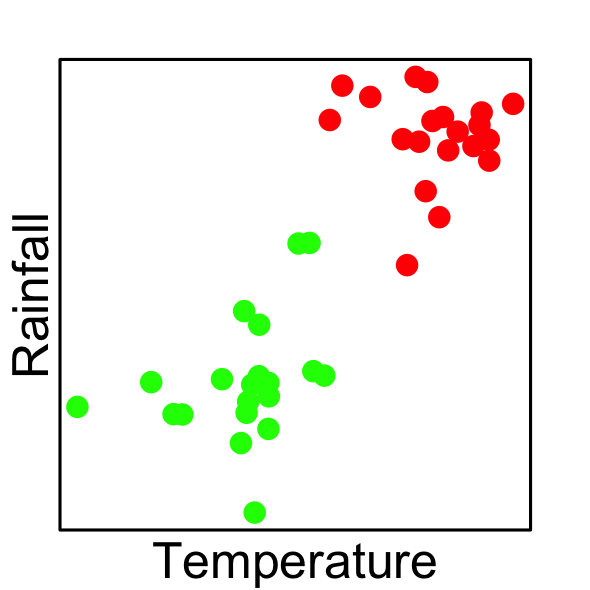
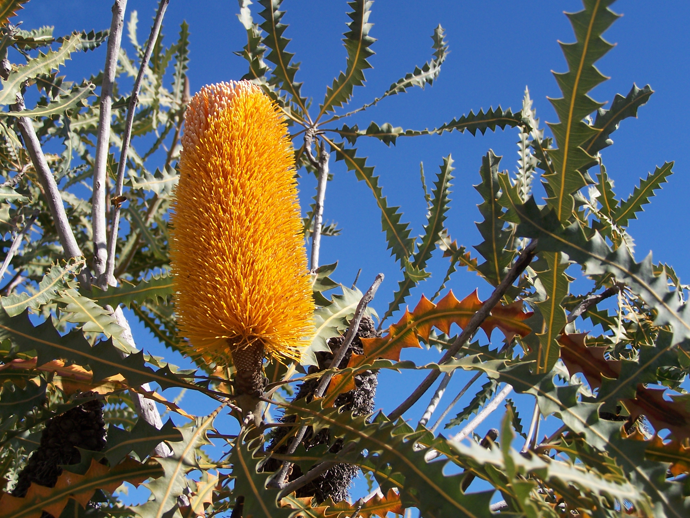
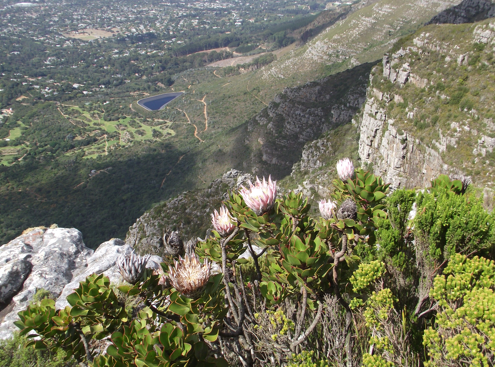
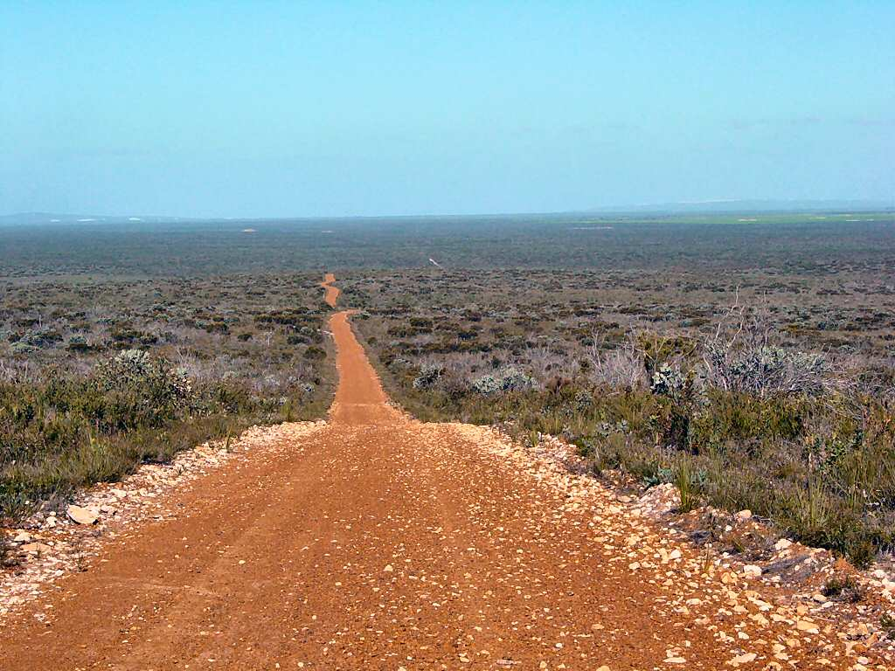
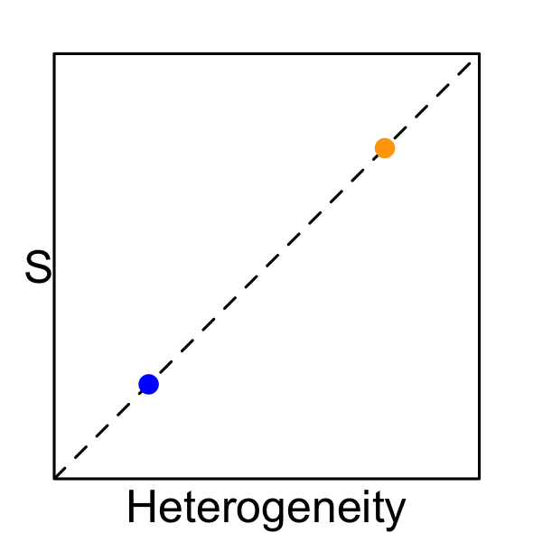
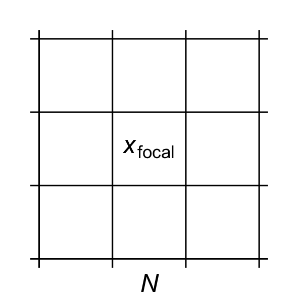
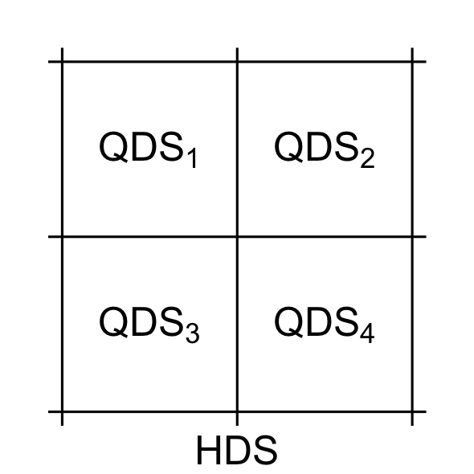

# Species richness ($S$)

\center

\onslide<3->\alt<3>{Extremely high $S$?}{Environmental heterogeneity (EH)}

\onslide<2->

Speciation \onslide<5->{\emph{along ecological gradients}}

{ width=3cm }

Co-existence \onslide<5->{\emph{within ecological space}}

{ width=3cm }

<!--
\footnotetext[1]{Cramer \& Verboom 2016. \emph{J. Biogeography} 44(3)}
\footnotetext[2]{Kreft \& Jetz 2007. \emph{PNAS} 104(14)}
\footnotetext[3]{Thuiller et al. 2006. \emph{Ecography} 29(5)}
-->

# The \textcolor{orange}{Cape} & \textcolor{blue}{SWA}

_TODO: maps of regions_

# Similar

  - \textcolor{brown}{Environments} \hfill _mediterranean, winter rainfall_
  - \textcolor{green}{Plant ecologies} \hfill _serotiny, sclerophylly_

\center { height=4cm } { height=4cm }

# But different

- $S$ per unit area \hfill \emph{\textcolor{orange}{Cape} > \textcolor{blue}{SWA}}
- Topographies \hfill \emph{\textcolor{orange}{mountainous} vs \textcolor{blue}{flat}}

\center { height=4cm } { height=4cm }

<!--
- Wide range of environmental conditions $\rightarrow$ supports diverse flora.
- Environmental stability through evolutionary time 
  - (Pleistocene LGM in Cape, ??? in SW Australia).
  - This means that the ecological gradients have persisted longer, facilitating greater degrees of ecological speciation, and thus species richness, along those gradients and barriers to gene flow.

Thus, spatially heterogeneous that is stable through deep time $\rightarrow$ support and produce more diverse biota. 

Environmental heterogeneity then has roles in the ecological present and over evolutionary time in stimulating species richness\footnotemark[1]\footnotemark[2]\footnotemark[3].

Cramer & Verboom 2016. _J. Biogeography_ 44(3)
Kreft & Jetz 2007. _PNAS_ 104(14)
Thuiller et al. 2006. \emph{Ecography} 29(5)
Gaston 2000. _Nature_ 405(6783)
Mouchet et al. 2015. _PLoS ONE_ 10(7)
-->

***

- \textcolor{orange}{Cape} richness previously shown to depend on heterogeneity\footnotemark[1]
- Does this extend to \textcolor{blue}{SWA}?

\footnotetext[1]{Cramer \& Verboom 2016. \emph{J. Biogeography} 44(3)}

***

\onslide<1-> \center { width=4cm }

Hypothesis         | \textcolor{orange}{Cape} vs \textcolor{blue}{SWA}
------------------:|:-------------------------------------------------:
\onslide<2->{Degree of EH}       | \onslide<3->{>}
\onslide<2->{Scale EH}           | \onslide<3->{<}
\onslide<4->{Floristic turnover} | \onslide<4->{>}
\onslide<5->{$S \sim$ EH}        | \onslide<5->{Both}
\onslide<6->{Types of EH}        | \onslide<7->{\textcolor{brown}{Soil?}}

# Data sources

- Each region’s boundaries
- \textcolor{brown}{Environmental data}
  - NASA MODIS, CHIRPS, SoilsGrid250m
- \textcolor{green}{Vascular plant occurrence records}
  - GBIF

# Environmental heterogeneity (EH)

\center

Local neighbourhood $N$ about cell $x_{focal}$

Roughness $R(N) = SD_{focal}(N)$

{ width=6cm }

***

\begin{figure}
  \begin{overprint}
    \onslide<1> \center
      \includegraphics[width=12cm]{figures/fig-1.1-elev-roughness_blank.png}
    \onslide<2-> \center 
      \includegraphics[width=12cm]{figures/fig-1.1-elev-roughness.png}
  \end{overprint}
\end{figure}

- \onslide<3-> Roughness varies with scale
- \onslide<3-> And differently so for the Cape and SWA

***

\begin{figure}
  \begin{overprint}
    \onslide<1> \center
      \includegraphics[width=7cm]{figures/fig-1.2-CLES-roughness_blank.png}
    \onslide<2-> \center 
      \includegraphics[width=7cm]{figures/fig-1.2-CLES-roughness.png}
  \end{overprint}
\end{figure}

- \onslide<3-> Different forms of roughness scale differently
- \onslide<3-> And differently so for the Cape \& SWA

# Species turnover

\center

Each HDS is composed of 2--4 QDS

$\overline{J}_{QDS} =$ average Jaccard distance between QDS

{ width=4cm }

***

\begin{figure}
  \begin{overprint}
    \onslide<1> \center
      \includegraphics[width=10cm]{figures/fig-2-turnover_blank.png}
    \onslide<2-> \center 
      \includegraphics[width=10cm]{figures/fig-2-turnover.png}
  \end{overprint}
\end{figure}

- \onslide<3-> The Cape has $\uparrow$ species turnover

# BRT-modelling

- Machine-learning
- Non-linear, complex and multivariate datasets

$$
  \hat{S} = w_1 t_1 + w_2 t_2 + w_3 t_3 + \dots + w_n t_n
$$

where $t_i =$ _TODO: Insert regression-tree image_

_TODO: Change $\hat{S}$-equation to version from Protea-SDMs slides_

***

```{r BRT-model-quality, out.width='12cm'}
knitr::include_graphics(here("SAAB-AMA-SASSB-2019-talk/figures/fig-4-BRT-model-quality.png"))
```

- Patterns different from chance (permuted null) \hfill $\checkmark$
- Cape patterns breakdown at coarser scales \hfill $\checkmark$
- SWA patterns do not \hfill $\checkmark$

***

```{r species-environment-relationships, out.width='12cm'}
knitr::include_graphics(here("SAAB-AMA-SASSB-2019-talk/figures/fig-3-species-environment-relationships.png"))
```

- Broad suite of variables vs MAP
- Roughness and soil vs absolute and climate

# Conclusions

i. The Cape has $\uparrow$ EH, \hfill $\checkmark$
ii. and at a finer spatial scale \hfill $\checkmark$
iii. The Cape has $\uparrow$ species turnover \hfill $\checkmark$
iv. $S$ and turnover are explained by EH \hfill $\checkmark$
v. Different axes of EH \hfill $\checkmark$

# Conclusions: Summary

i--iii. The Cape **is** more environmentally heterogeneous \hfill $\checkmark$

iv--v. Different forms of heterogeneity **do** matter in the Cape and SWA \hfill $\checkmark$

```{r hypothesis-6, fig.width=2, fig.height=2, out.width='3cm', out.height='3cm'}
plot_hypothesis()
```

***

\center \textcolor{brown}{Soil?}

***

\center Thank you\footnotemark[1]!

\footnotetext[1]{And an extra thank you to Mike and Tony}
