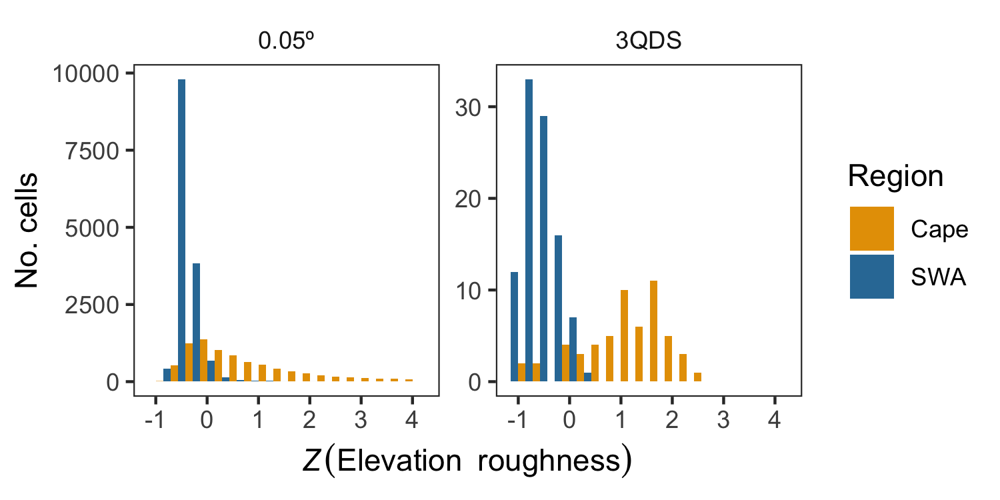

```{r setup, include=FALSE}
knitr::opts_chunk$set(
  echo = FALSE,
  message = FALSE,
  warning = FALSE,
  fig.align = "center"
)
library(here)
source(here("R/figure-scripts/talk-figures/explanatory-plots.R"))
```

# Species richness ($S$)

\center Speciation along ecological gradients

\center { width=3cm }

<!--FIXME
```{r speciation, out.width='3cm'}
knitr::include_graphics(here("SAAB-AMA-SASSB-2019-talk/figures/speciation.png"))
```
-->

\center Co-existence within ecological space

```{r co-existence, fig.width=2, fig.height=2, out.width='3cm', out.height='3cm'}
plot_coexistence()
```

# How to explain extremely high $S$?

Environmental heterogeneity\footnotemark[1]\footnotemark[2]\footnotemark[3]

- $\uparrow$ gradients : $\uparrow$ speciation
- $\uparrow$ habitats : $\uparrow$ co-existence

\footnotetext[1]{Cramer \& Verboom 2016. \emph{J. Biogeography} 44(3)}
\footnotetext[2]{Kreft \& Jetz 2007. \emph{PNAS} 104(14)}
\footnotetext[3]{Thuiller et al. 2006. \emph{Ecography} 29(5)}

# The \textcolor{orange}{Cape} & \textcolor{blue}{SWA}

_TODO: maps of regions_

# The \textcolor{orange}{Cape} & \textcolor{blue}{SWA}

- Similar
  - \textcolor{brown}{Environments} \hfill _mediterranean, winter rainfall_
  - \textcolor{green}{Plant ecologies} \hfill _serotiny, sclerophylly_

- Different
  - $S$ per unit area \hfill _Cape > SWA_
  - Topographies \hfill _mountainous vs flat_

# The \textcolor{orange}{Cape} & \textcolor{blue}{SWA}

- Wide range of environmental conditions $\rightarrow$ supports diverse flora.
- Environmental stability through evolutionary time 
  - (Pleistocene LGM in Cape, ??? in SW Australia).
  - This means that the ecological gradients have persisted longer, facilitating greater degrees of ecological speciation, and thus species richness, along those gradients and barriers to gene flow.

# The \textcolor{orange}{Cape} & \textcolor{blue}{SWA}

Thus, spatially heterogeneous that is stable through deep time $\rightarrow$ support and produce more diverse biota. 

Environmental heterogeneity then has roles in the ecological present and over evolutionary time in stimulating species richness\footnotemark[1]\footnotemark[2]\footnotemark[3].

\footnotetext[1]{Cramer \& Verboom 2016. \emph{J. Biogeography} 44(3)}
\footnotetext[2]{Kreft \& Jetz 2007. \emph{PNAS} 104(14)}
\footnotetext[3]{Thuiller et al. 2006. \emph{Ecography} 29(5)}

<!--
Cramer & Verboom 2016. _J. Biogeography_ 44(3)
Gaston 2000. _Nature_ 405(6783)
Kreft & Jetz 2007. _PNAS_ 104(14)
Mouchet et al. 2015. _PLoS ONE_ 10(7)
Thuiller et al. 2006. _Ecography_ 29(5)
-->

# Hypotheses

- \textcolor{orange}{Cape} richness previously shown to depend on heterogeneity\footnotemark[1]
- Does this extend to \textcolor{blue}{SWA}?

```{r hypothesis-1, fig.width=2, fig.height=2, out.width='3cm', out.height='3cm'}
plot_hypothesis()
```

\footnotetext[1]{Cramer \& Verboom 2016. \emph{J. Biogeography} 44(3)}

# Hypotheses

i. The Cape has $\uparrow$ environmental heterogeneity (EH),
ii. and at a finer spatial scale

```{r hypothesis-2, fig.width=2, fig.height=2, out.width='3cm', out.height='3cm'}
plot_hypothesis()
```

# Hypotheses

iii. The Cape has $\uparrow$ species turnover

```{r hypothesis-3, fig.width=2, fig.height=2, out.width='3cm', out.height='3cm'}
plot_hypothesis()
```

# Hypotheses

iv. $S$ and turnover are explained by EH
v. Different axes of EH are NB in the Cape and SWA 

\textcolor{brown}{(Soil?)}
  
```{r hypothesis-4, fig.width=2, fig.height=2, out.width='3cm', out.height='3cm'}
plot_hypothesis()
```

# Hypotheses: Summary

i--iii. The Cape should be more environmentally heterogeneous

iv--v. Different forms of heterogeneity should matter in the Cape and SWA

```{r hypothesis-5, fig.width=2, fig.height=2, out.width='3cm', out.height='3cm'}
plot_hypothesis()
```

# Data sources

- Each region’s boundaries
- \textcolor{brown}{Environmental data}
  \par \hfill NASA MODIS
  \par \hfill CHIRPS
  \par \hfill SoilsGrid250m
- \textcolor{green}{Vascular plant occurrence records}
  \par \hfill GBIF

# Environmental heterogeneity

Local neighbourhood $N$ about cell $x_{focal}$

$Roughness(N) = SD_{focal}(N)$

```{r roughness-neighbourhood, fig.width=2, fig.height=2, out.width='3cm', out.height='3cm'}
plot_neighbourhood()
```

***

```{r elev-roughness, out.width='12cm'}

```

- Roughness varies with scale
- And differently so for the Cape and SWA

***

```{r CLES-roughness, out.width='7cm'}
knitr::include_graphics(here("SAAB-AMA-SASSB-2019-talk/figures/fig-1.2-CLES-roughness.png"))
```

- Different forms of roughness scale differently
- And differently so for the Cape and SWA

# Species turnover

Local neighbourhood $N$ about cell $x_{focal}$

$\overline{J}(N) =$ average Jaccard distance between cells

```{r turnover-neighbourhood, fig.width=2, fig.height=2, out.width='3cm', out.height='3cm'}
plot_neighbourhood()
```

***

```{r turnover, out.width='10cm'}
knitr::include_graphics(here("SAAB-AMA-SASSB-2019-talk/figures/fig-2-turnover.png"))
```

- The Cape has $\uparrow$ species turnover

# BRT-modelling

- Machine-learning
- Non-linear, complex and multivariate datasets

$$
  \hat{S} = w_1 t_1 + w_2 t_2 + w_3 t_3 + \dots + w_n t_n
$$

where $t_i =$ _TODO: Insert regression-tree image_

_TODO: Change $\hat{S}$-equation to version from Protea-SDMs slides_

***

```{r BRT-model-quality, out.width='12cm'}
knitr::include_graphics(here("SAAB-AMA-SASSB-2019-talk/figures/fig-4-BRT-model-quality.png"))
```

- Patterns different from chance (permuted null) \hfill $\checkmark$
- Cape patterns breakdown at coarser scales \hfill $\checkmark$
- SWA patterns do not \hfill $\checkmark$

***

```{r species-environment-relationships, out.width='12cm'}
knitr::include_graphics(here("SAAB-AMA-SASSB-2019-talk/figures/fig-3-species-environment-relationships.png"))
```

- Broad suite of variables vs MAP
- Roughness and soil vs absolute and climate

# Conclusions

i. The Cape has $\uparrow$ EH, \hfill $\checkmark$
ii. and at a finer spatial scale \hfill $\checkmark$
iii. The Cape has $\uparrow$ species turnover \hfill $\checkmark$
iv. $S$ and turnover are explained by EH \hfill $\checkmark$
v. Different axes of EH \hfill $\checkmark$

# Conclusions: Summary

i--iii. The Cape **is** more environmentally heterogeneous \hfill $\checkmark$

iv--v. Different forms of heterogeneity **do** matter in the Cape and SWA \hfill $\checkmark$

```{r hypothesis-6, fig.width=2, fig.height=2, out.width='3cm', out.height='3cm'}
plot_hypothesis()
```

***

\center \textcolor{brown}{Soil?}

***

\center Thank you\footnotemark[1]!

\footnotetext[1]{And an extra thank you to Mike and Tony}
