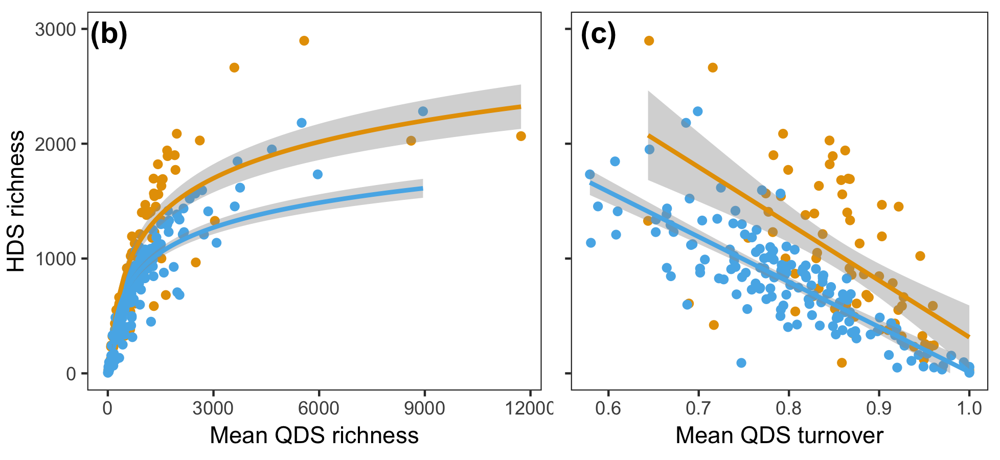

```{r setup, include=FALSE}
knitr::opts_chunk$set(
  eval = TRUE,
  echo = TRUE,
  message = FALSE,
  warning = FALSE,
  fig.height = 4,
  fig.width = 4
)
```

```{r, include=FALSE}
source(here::here("setup.R"))
library(visreg)
import_objects(here::here("outputs/species-turnover-and-richness/"))
```

# The model

The HDS richness model (manuscript Equation (2); Equation (1) below) describes how coarse scale species richness varies as the integration of fine scale richness and fine scale turnover.

\begin{equation}
\begin{split}
  HDS \ richness =
    &\ Intercept + \\
    &\ Mean \ QDS \ richness +
       Mean \ QDS \ turnover +
       SWA + 
       (= \ main \ effects) \\
    &\ Mean \ QDS \ richness \times SWA + \ (= \ interaction \ effects) \\
    &\ Mean \ QDS \ turnover \times SWA
\end{split}
\end{equation}

```{r, echo=FALSE}
tidy_terms <- c(
  "Intercept",
  "$log($Mean QDS richness + 1$)$",
  "Mean QDS turnover",
  "SWA",
  "$log($Mean QDS richness + 1$)$ $\\times$ SWA",
  "Mean QDS turnover $\\times$ SWA"
)
species_model_table <- my_model_table(
  model = species_turnover_richness_HDS_m,
  tidy_terms = tidy_terms,
  AIC_table = species_HDS_AIC_table
)
knitr::kable(
  species_model_table$model_table, 
  align = c("l", "r", "r"),
  caption = "Summary of coefficients and P-values for the HDS richness model in Equation (1) above"
)
```

# Conditional plots

Conditional plots such as these (Fig. 1,2) generated by `visreg`[^1] based on the results in Table 1, plot the relationship between the response and one of the predictors while assuming the values of all other predictors are constant at their observed medians (see `?visreg`). This is especially useful and pertainant to our model, as it has two interaction terms---one for each of the relationships in Fig. 1 and 2 respectively.

Compare the conditional plots to the un-transformed scatter-plots (Fig. 3b,c).

[^1]: Breheny, P. & Burchett, W. (2017). Visualization of Regression Models Usin visreg. The R Journal, 9: 56-71.

```{r, echo=FALSE, fig.cap="Conditional plot of HDS richness as function mean QDS richness."}
visreg::visreg(
  species_turnover_richness_HDS_m, 
  xvar = "avg_QDS_richness", 
  by = "region", 
  overlay = TRUE, 
  ylim = c(0, 3000),
  xlab = "Mean QDS richness",
  ylab = "HDS richness"
)
```

```{r, echo=FALSE, fig.cap="Conditional plot of HDS richness as function mean QDS turnover."}
visreg::visreg(
  species_turnover_richness_HDS_m,
  xvar = "avg_QDS_turnover", 
  by = "region", 
  overlay = TRUE,
  ylim = c(0, 3000),
  xlab = "Mean QDS turnover",
  ylab = "HDS richness"
)
```



# High species turnover between low richness sites??

> _Why does high turnover arise from low richness QDS? Because when site richness is low, possible opportunities for high turnover between sites increase._

This is paraphrased from my draft of my results section (as of `r format(Sys.time(), "%F")`).

I think that understanding the artefact of observed declines in HDS richness with increased turnover (Fig. 3c) has a lot to do with how we interpret these conditional plots.

## Example 1

```{r, include=FALSE}
species_pool <- 1:200
```

To ease into thinking about how richness affects possible turnover values, let's start with a simple example.

Suppose we have 200 possible species in a broader species pool. If two sites, a and b, each have a random 100 of those species, we see that we have some turnover. 

```{r}
site_a <- sample(species_pool, size = 100, replace = FALSE)
site_b <- sample(species_pool, size = 100, replace = FALSE)
jaccard_distance(site_a, site_b)
```

If each site is much less rich, we see that we have almost complete turnover. 

```{r}
site_a <- sample(species_pool, size = 10, replace = FALSE)
site_b <- sample(species_pool, size = 10, replace = FALSE)
jaccard_distance(site_a, site_b)
```

If sites are of richness similar or approaching the regional pool, we have almost no turnover.

```{r}
site_a <- sample(species_pool, size = 190, replace = FALSE)
site_b <- sample(species_pool, size = 190, replace = FALSE)
jaccard_distance(site_a, site_b)
```

I hope that these results are intuitive.

## Some interpretation

I think that there are three components to this phenomenon:

1. The regional species pool's richness
2. The average richness of sites
3. The disparity between site and regional richness (i.e. how low the lower-bound of site richness is, and how high and close to regional richness the upper-bound of site richness is).

## Example 2

If we suggest that sites can have richness between 50 and 150 (when regional richness is still 200), then when we order sites by their richness, we see that turnover (as expected) is much lower in high richness sites

```{r, echo=FALSE}
richnesses <- 50:150
turnovers <- map_dbl(
  .x = richnesses,
  .f = function(.x) {
    site_a <- sample(species_pool, size = .x, replace = FALSE)
    site_b <- sample(species_pool, size = .x, replace = FALSE)
    jaccard_distance(site_a, site_b)
  }
)
plot(
  turnovers ~ richnesses, 
  xlab = "Richness of site a & b", 
  ylab = "Turnover"
)
abline(lm(turnovers ~ richnesses))
```

Or, to align with the HDS richness model (Equation (1)), we can say that high turnover sites "have" generally lower richness.

```{r, echo=FALSE}
plot(
  richnesses ~ turnovers, 
  xlab = "Turnover",
  ylab = "Richness of site a & b"
)
abline(lm(richnesses ~ turnovers))
```

If we lower the upper-bound on site richness to 75, the pattern weakens (as expected)

```{r, echo=FALSE}
richnesses <- 50:75
turnovers <- map_dbl(
  .x = richnesses,
  .f = function(.x) {
    site_a <- sample(species_pool, size = .x, replace = FALSE)
    site_b <- sample(species_pool, size = .x, replace = FALSE)
    jaccard_distance(site_a, site_b)
  }
)
plot(
  turnovers ~ richnesses, 
  xlab = "Richness of site a & b", 
  ylab = "Turnover"
)
abline(lm(turnovers ~ richnesses))
```

# Some conclusions

The association between lower richness sites and high turnover between them seems to be a necessary consequence of there being structuring of richness at different scales at all---and not indicative of any biological process per se.

This has implications for our study, in that I think we should be comparing not the HDS richness vs mean QDS turnover line _themselves_ between the Cape and SWA (Fig. 3c), but rather these relationships corrected for the differing richnesses of the QDS sites.

Does that sound familiar? It should, because that is exactly what the conditional plots (Fig. 1,2) do!
